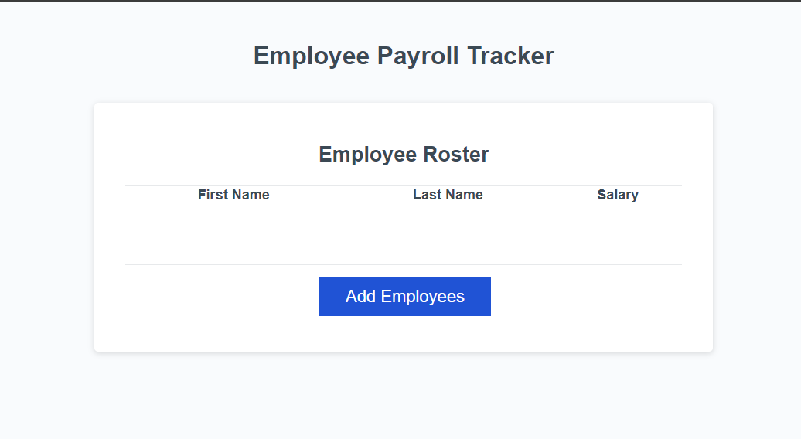

### Employee Payroll Tracker

## Functionallity
```
This webpage will create a table of employees to keep track of salaries.
To add an employee to the table select 'Add Employee'.
Then enter the first name, last name, and salary of the employee.
It will ask if you want to add another, select 'OK' if you do.
When you are done all the employees will be displayed on the table with their first name, last name, and salary.
It will also log the average salary in the console along with a random employee selected at random.
```
## User Story
```
AS A payroll manager
I WANT AN employee payroll tracker
SO THAT I can see my employees' payroll data and properly budget for the company
```
## Acceptance Criteria
```
GIVEN an employee payroll tracker
WHEN I click the "Add employee" button
THEN I am presented with a series of prompts asking for first name, last name, and salary
WHEN I finish adding an employee
THEN I am prompted to continue or cancel
WHEN I choose to continue
THEN I am prompted to add a new employee
WHEN I choose to cancel
THEN my employee data is displayed on the page sorted alphabetically by last name, and the console shows computed and aggregated data
```
## Summary
I was given starter code of an non-functioning employee payroll tracker. I added javascript to it in order for the 'Add Employees' button to work. It also averages up all the salaries and picks a random employee and logs it in the console.

## Link to Deployed Website
[Link text] (https://milkytea6.github.io/empolyee-payroll-tracker/ 'Link to Empolyee Payroll Tracker')

## Screenshot of Webpage
